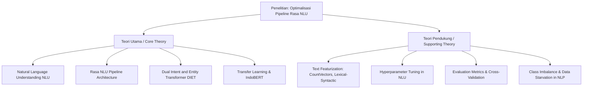

# Catatan Akademis: Optimalisasi Pipeline Rasa NLU pada Chatbot Rekomendasi Mobil

Dokumen ini berisi draf terstruktur untuk bab pendahuluan dan landasan teori skripsi/penelitian, yang disesuaikan dengan judul penelitian: **"Optimalisasi Pipeline Rasa NLU"** pada chatbot rekomendasi mobil berbahasa Indonesia.

---

## 1. Identifikasi Masalah (Problem Identification)

Dalam konteks **Optimalisasi Pipeline**, masalah utama yang dihadapi bukan terletak pada kegagalan fungsional chatbot, melainkan pada **keterbatasan performa pipeline default (baseline)** saat menangani kompleksitas bahasa manusia dengan batasan dataset tertentu. Masalah tersebut diidentifikasi sebagai berikut:

### A. Ambiguitas Semantik pada Intent Utama (Semantic Overlap)
* **Masalah:** Pipeline default (menggunakan `CountVectorsFeaturizer` tradisional) mengalami tumpang tindih makna (*confusion*) yang sangat tinggi antara intent `choose_preference` (menyatakan kriteria pilihan) dan `ask_recommendation` (meminta rekomendasi).
* **Bukti Empiris:** Pada pengujian baseline, model salah mengklasifikasikan 100% data *error* pada *train-test split* (110 sampel) dari `choose_preference` menjadi `ask_recommendation`. Hal ini disebabkan karena kemiripan struktur leksikal (kosa kata yang sama seperti nama merek, transmisi, dll.) tanpa adanya pemahaman konteks semantik kalimat yang mendalam pada pipeline default.

### B. Kerentanan terhadap Ketimpangan Sampel (Class Imbalance)
* **Masalah:** Distribusi dataset latih antar kelas intent sangat tidak seimbang (rasio kelas mayoritas vs minoritas mencapai **16.6 : 1**). Pipeline default cenderung bias terhadap intent mayoritas dan gagal menggeneralisasikan intent minoritas.
* **Bukti Empiris:** Intent `choose_preference` memiliki 332 sampel sedangkan `ask_similar_car` hanya memiliki 20 sampel. Akibatnya, pada validasi silang (cross-validation), model default menghasilkan F1-score yang rendah pada intent-intent minoritas karena tidak adanya mekanisme bobot kelas (*class weighting*) atau fitur representasi yang kuat.

### C. Rendahnya Kinerja Ekstraksi Entitas dengan Sampel Terbatas
* **Masalah:** Pipeline default mengalami penurunan performa yang signifikan saat mengekstrak entitas negasi dengan jumlah sampel yang sangat kecil (seperti `feature.negated`).
* **Bukti Empiris:** Pada pengujian validasi silang (*5-Fold Cross-Validation*), entitas `feature.negated` hanya memperoleh rata-rata F1-score sebesar **0.691** (69.1%). Masalah ini disebabkan oleh keterbatasan jumlah sampel (hanya 7 sampel untuk `feature.negated` pada berkas `nlu.yml`), sehingga featurizer tradisional (`CountVectors` + `LexicalSyntactic`) pada pipeline default kesulitan menangkap representasi pola negasi yang memadai untuk digeneralisasikan pada data uji baru.

---

## 2. Tujuan Penelitian (Research Objectives)

Penelitian ini bertujuan untuk melakukan **optimalisasi pipeline Rasa NLU** melalui langkah-langkah berikut:
1. Menentukan konfigurasi pipeline Rasa NLU yang paling optimal (membandingkan baseline Default dengan varian eksperimental **TAv1 s.d. TAv6**) untuk meningkatkan akurasi klasifikasi intent dan ekstraksi entitas.
2. Mengatasi masalah ambiguitas semantik pada klasifikasi intent dengan mengintegrasikan fitur kontekstual berbasis *Pre-trained Language Model* (transfer learning menggunakan **IndoBERT**).
3. Mengevaluasi trade-off antara peningkatan kinerja model (*generalization*) dan risiko *overfitting* yang disebabkan oleh perubahan arsitektur featurizer serta jumlah epoch latihan.
4. Menganalisis ketahanan masing-masing konfigurasi pipeline dalam menangani entitas bermakna negasi di bawah kondisi kelangkaan sampel data (*data starvation*).

---

## 3. Batasan Masalah (Scope Limitations)

Untuk menjaga fokus penelitian pada topik **Optimalisasi Pipeline**, batasan masalah ditetapkan sebagai berikut:
1. **Fokus Arsitektur:** Penelitian ini hanya berfokus pada optimasi komponen **NLU (Natural Language Understanding)** Rasa, khususnya modul *Intent Classifier* dan *Entity Extractor*. Penelitian tidak membahas modul *Dialogue Management* (Rasa Core), alur logika dialog (*stories*), pembuatan *actions* bot, maupun integrasi sistem rekomendasi backend (seperti metode VIKOR).
2. **Subjek Penelitian (Dataset):** Dataset yang digunakan dibatasi pada data percakapan berbahasa Indonesia formal/informal seputar rekomendasi mobil yang didefinisikan dalam berkas `data/nlu.yml` (aktif) yang terdiri dari 6 intent dan 16 entitas (termasuk 6 entitas negasi).
3. **Variasi Pipeline:** Eksperimen optimalisasi dibatasi pada 7 jenis pipeline: 1 pipeline default (baseline) dan 6 pipeline eksperimen (TAv1 s.d. TAv6) yang mengombinasikan komponen featurizer tradisional, IndoBERT, regulasi dropout, serta optimasi epoch.
4. **Metrik Evaluasi:** Evaluasi performa pipeline dibatasi pada metrik Accuracy, Precision, Recall, F1-Score, stabilitas model (Standar Deviasi), dan nilai Overfitting Gap melalui metode *5-Fold Cross Validation* (3 kali pengulangan) dan *Train-Test Split*.

---

## 4. Teori yang Dipakai dalam Penelitian (Theoretical Framework)

### A. Teori Utama (Core Theories)
1. **Natural Language Understanding (NLU) dalam Chatbot:**
   NLU adalah sub-bidang dari NLP yang bertanggung jawab untuk memahami input teks pengguna secara semantik. NLU mengekstrak dua informasi penting: *Intent* (tujuan/maksud pengguna) dan *Entity* (variabel kunci atau parameter di dalam kalimat).
2. **Arsitektur Pipeline Rasa NLU:**
   Rasa memproses teks masukan pengguna secara sekuensial melalui serangkaian komponen yang disebut *pipeline*. Komponen ini terdiri dari:
   * *Tokenizer:* Memecah teks menjadi token kata.
   * *Featurizer:* Mengubah token teks menjadi representasi vektor numerik (*embeddings*).
   * *Intent Classifier / Entity Extractor:* Mengklasifikasikan maksud kalimat dan melabeli entitas.
3. **Dual Intent and Entity Transformer (DIET) Classifier:**
   Model multi-task transformer yang dikembangkan oleh Rasa untuk menangani klasifikasi intent dan ekstraksi entitas secara bersamaan. DIET memanfaatkan mekanisme *self-attention* untuk memahami konteks kalimat secara non-sekuensial dan terbukti efisien pada dataset skala kecil hingga menengah.
4. **Transfer Learning & IndoBERT:**
   *Transfer learning* adalah teknik di mana model yang telah dilatih pada dataset raksasa (dalam hal ini bahasa Indonesia umum) digunakan kembali untuk tugas khusus. **IndoBERT** adalah model BERT (Bidirectional Encoder Representations from Transformers) berbahasa Indonesia yang mampu menghasilkan representasi vektor kata berdasarkan konteks kalimat sekitarnya (*contextual embeddings*).

### B. Teori Pendukung (Supporting Theories)
1. **Ekstraksi Fitur Tradisional (Traditional Featurization):**
   * **CountVectorsFeaturizer:** Mengonversi teks ke dalam bentuk matriks frekuensi kata. Menggunakan pendekatan *Bag-of-Words* dan *character n-grams* untuk membantu model mengenali pola ejaan dan kata dasar tanpa memerlukan kamus kosakata formal.
   * **LexicalSyntacticFeaturizer:** Mengekstrak fitur leksikal tingkat rendah (seperti huruf kapital, angka, tanda baca) untuk membantu identifikasi batas fisik entitas.
2. **Metode Penalaan Parameter (Hyperparameter Tuning):**
   Teori mengenai pengaruh jumlah iterasi (*epochs*), laju pembelajaran (*learning rate*), ukuran batch (*batch size*), dan tingkat regulasi (*dropout*) dalam mengontrol kecepatan pelatihan model serta meminimalisasi bias dan varians.
3. **Metrik Evaluasi Klasifikasi & Validasi Silang:**
   * **Precision, Recall, F1-Score:** Metrik evaluasi performa klasifikasi. F1-Score sangat penting karena merupakan rata-rata harmonis antara presisi dan recall, yang andal dalam mengevaluasi model pada dataset tidak seimbang.
   * **Confusion Matrix:** Representasi visual berbentuk tabel untuk menganalisis misklasifikasi antar kelas.
   * **K-Fold Cross Validation:** Teknik membagi dataset menjadi K lipatan secara acak untuk menguji stabilitas model pada data uji yang belum pernah dilihat (*unseen data*).
4. **Ketimpangan Kelas (Class Imbalance) & Kelangkaan Data (Data Starvation) pada NLP:**
   Teori yang membahas bagaimana ketidakseimbangan jumlah sampel data latih dapat mendistorsi fungsi kerugian (*loss function*) model ML, sehingga model cenderung mengabaikan kelas minoritas (seperti `ask_similar_car` dan `feature.negated`) dan bagaimana dampaknya dapat dikurangi melalui representasi fitur yang lebih kaya (seperti IndoBERT) atau penambahan data.
