# UML Diagram — Chatbot Rekomendasi Mobil

## 1. Use Case Diagram

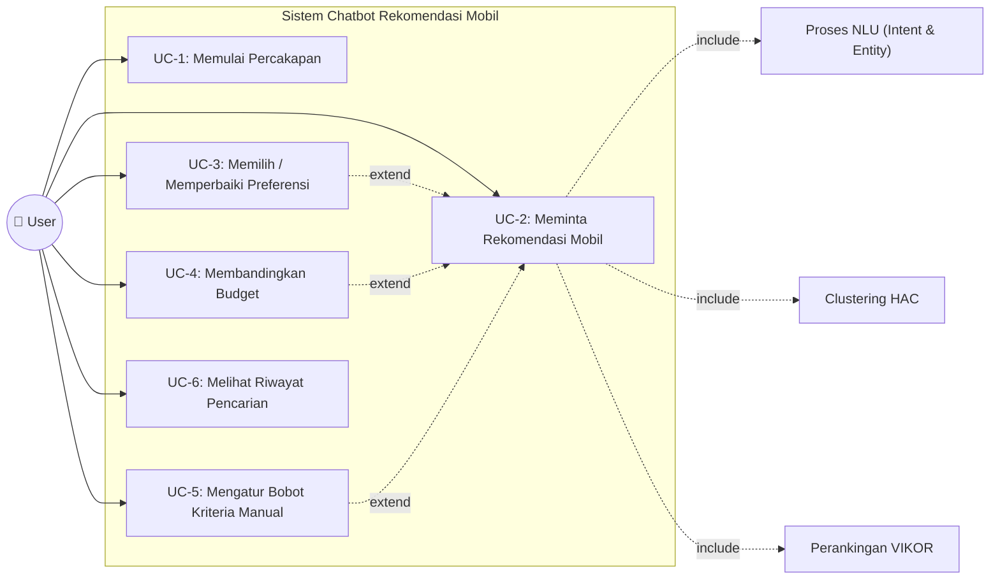

### Deskripsi Use Case

| UC | Nama | Aktor | Deskripsi |
|----|------|-------|-----------|
| UC-1 | Memulai Percakapan | User | User menyapa chatbot, sistem membalas sapaan |
| UC-2 | Meminta Rekomendasi Mobil | User | User menyebutkan budget/kebutuhan, sistem memproses NLU → Clustering → VIKOR dan menampilkan Top-N rekomendasi |
| UC-3 | Memilih/Memperbaiki Preferensi | User | User menyempurnakan kriteria pencarian (preferensi, fitur, powertrain) pada sesi yang sama |
| UC-4 | Membandingkan Budget | User | User meminta perbandingan hasil rekomendasi dengan budget yang dinaikkan |
| UC-5 | Mengatur Bobot Kriteria Manual | User | User mengatur slider bobot (Performa, Irit, Kenyamanan, dll.) di UI frontend |
| UC-6 | Melihat Riwayat Pencarian | User | User melihat atau menghapus riwayat evaluasi pencarian sebelumnya |

---

## 2. Activity Diagram

### 2.1 Activity Diagram — UC-1: Memulai Percakapan

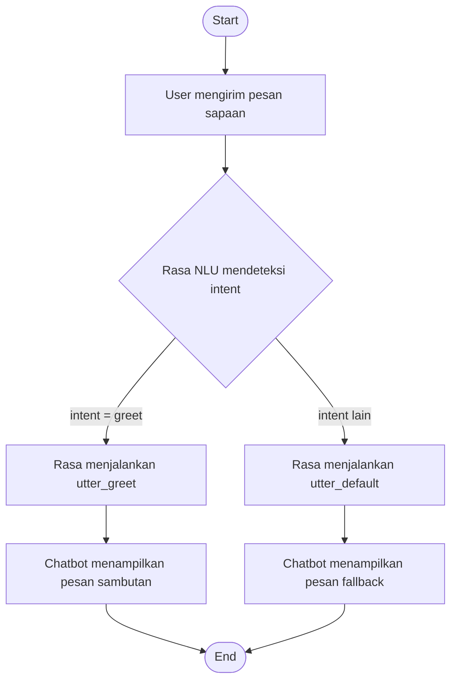

### 2.2 Activity Diagram — UC-2: Meminta Rekomendasi Mobil

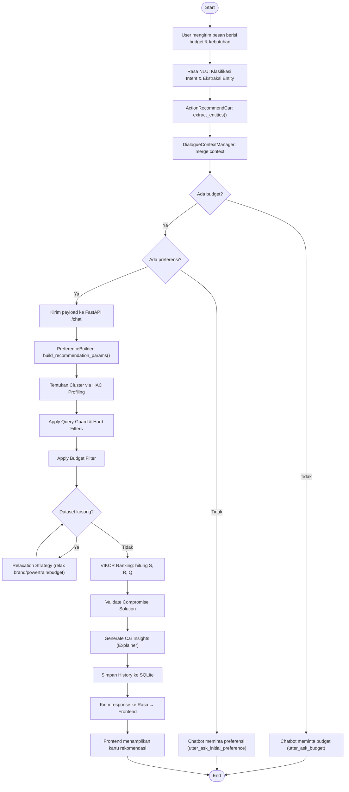

### 2.3 Activity Diagram — UC-3: Memilih/Memperbaiki Preferensi

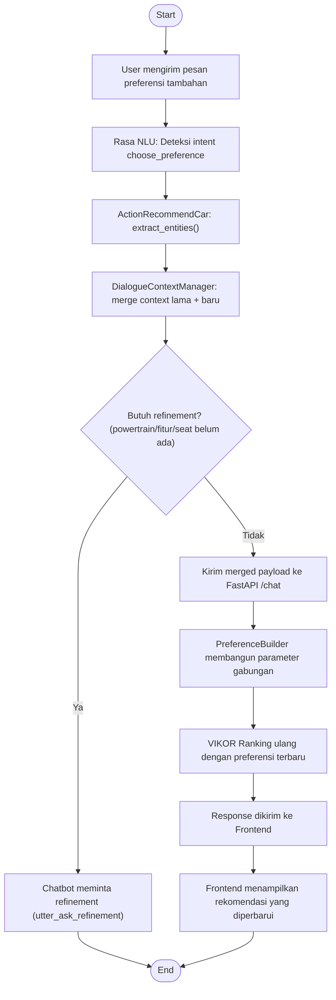

### 2.4 Activity Diagram — UC-4: Membandingkan Budget

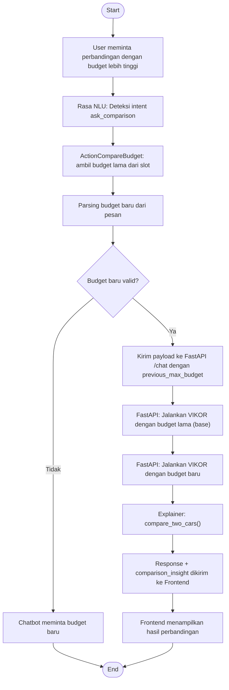

### 2.5 Activity Diagram — UC-5: Mengatur Bobot Kriteria Manual

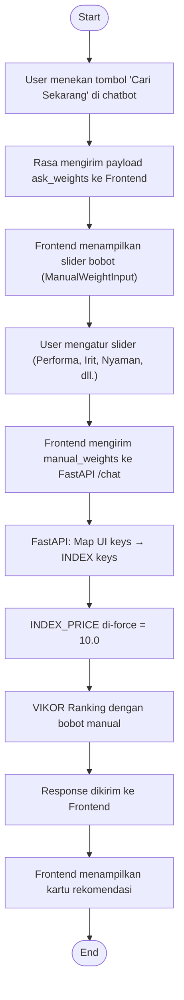

### 2.6 Activity Diagram — UC-6: Melihat Riwayat Pencarian

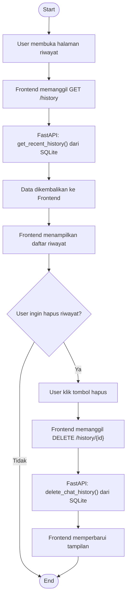

---

## 3. Sequence Diagram

### 3.1 Sequence Diagram — UC-1: Memulai Percakapan

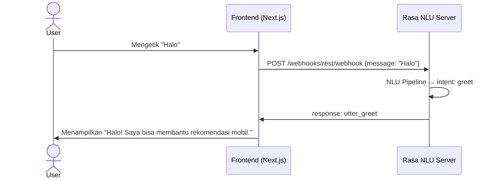

### 3.2 Sequence Diagram — UC-2: Meminta Rekomendasi Mobil

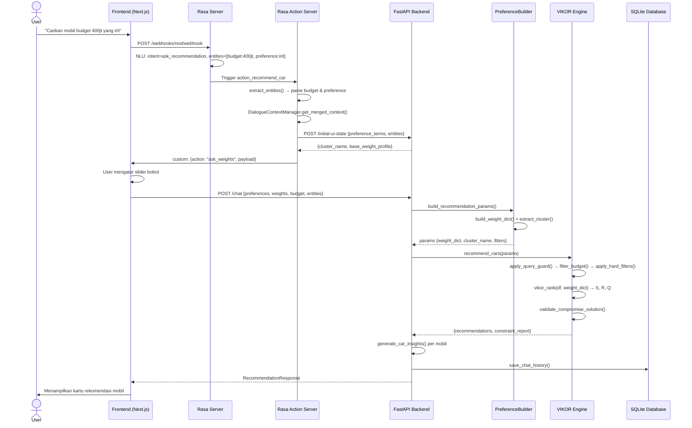

### 3.3 Sequence Diagram — UC-3: Memilih/Memperbaiki Preferensi

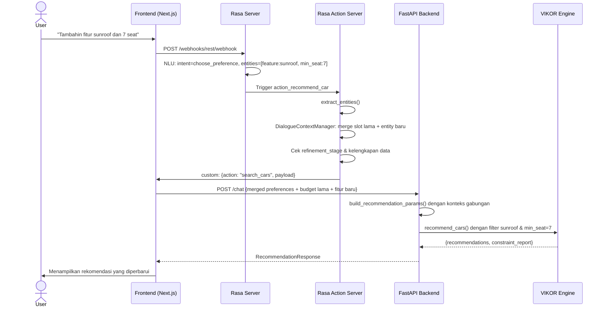

### 3.4 Sequence Diagram — UC-4: Membandingkan Budget

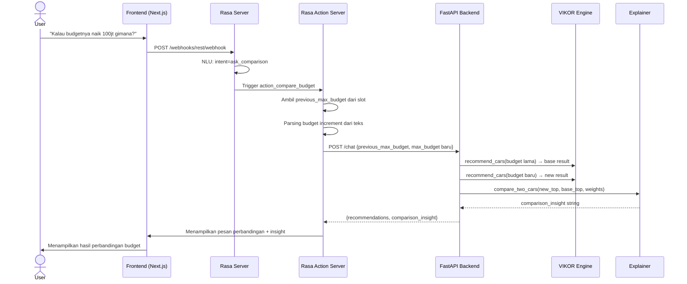

### 3.5 Sequence Diagram — UC-5: Mengatur Bobot Kriteria Manual

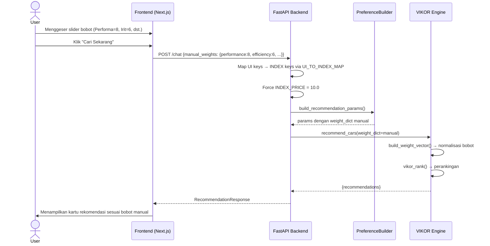

### 3.6 Sequence Diagram — UC-6: Melihat Riwayat Pencarian

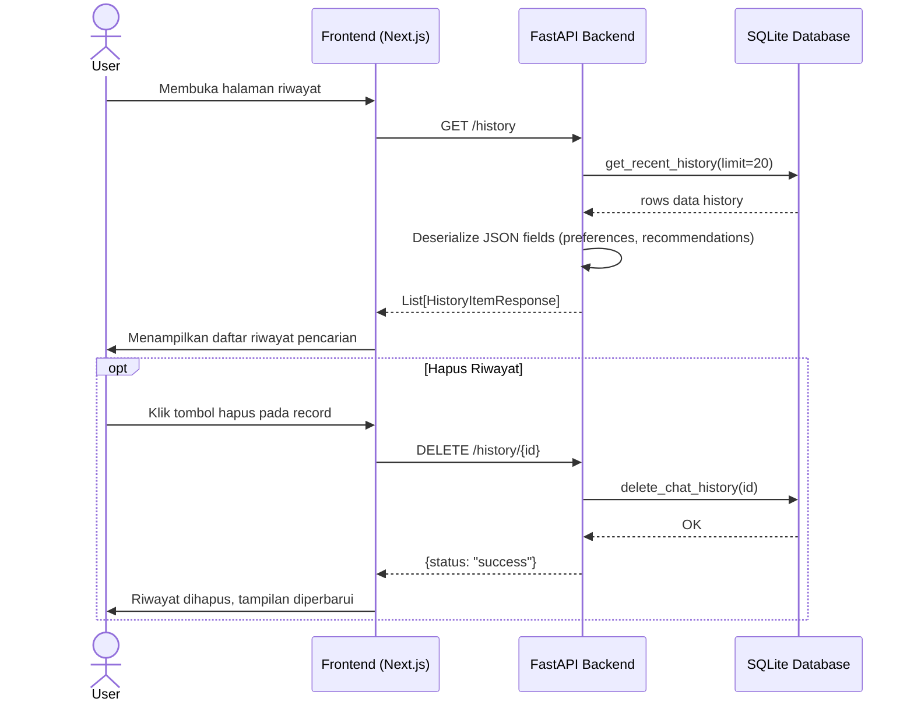

---

## 4. Class Diagram

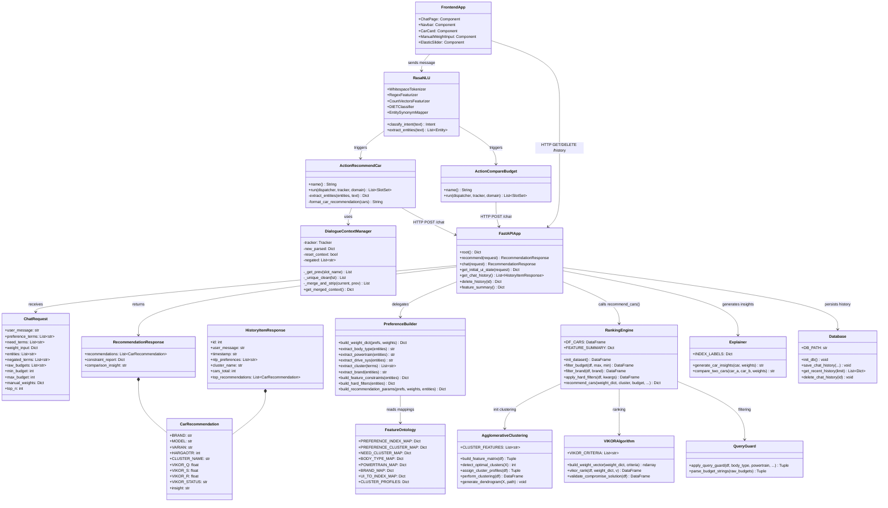
