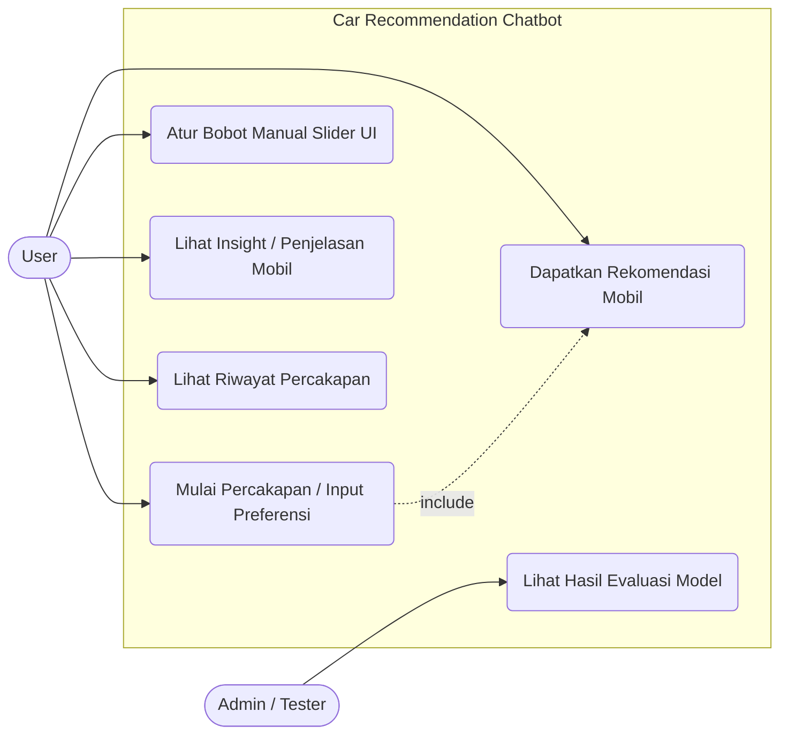
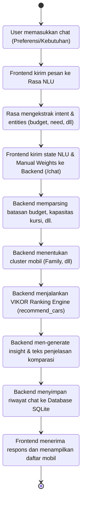
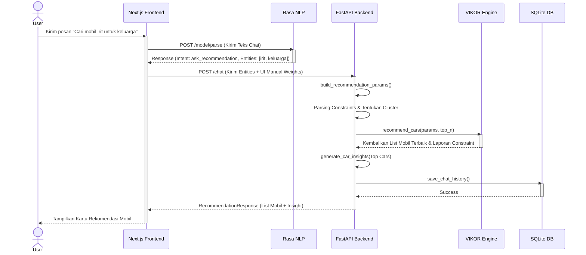
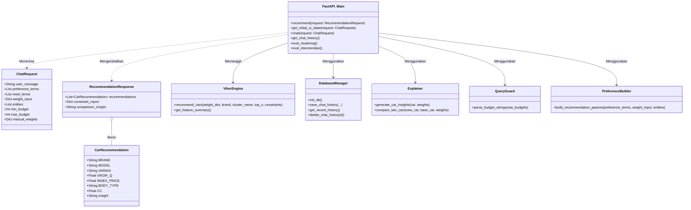

# UML Diagrams - Car Recommendation Chatbot

Berikut adalah representasi diagram Use Case, Activity, Sequence, dan Class untuk proyek Chatbot Rekomendasi Mobil Anda. Diagram-diagram ini dibuat menggunakan Mermaid JS berdasarkan struktur *codebase* Anda.

## 1. Use Case Diagram
Diagram ini menunjukkan fungsionalitas sistem yang dapat diakses oleh *User* dan *Admin/Tester*.

## 2. Activity Diagram
Diagram ini menggambarkan alur aktivitas dari sistem, mulai dari pengguna memberikan input chat hingga mendapatkan output rekomendasi akhir beserta *insight*-nya.

## 3. Sequence Diagram
Diagram sekuensi ini menunjukkan urutan interaksi antar komponen (*Frontend*, *Rasa*, *FastAPI Backend*, dan *VIKOR Engine*) secara kronologis saat *user* meminta rekomendasi.

## 4. Class Diagram
Diagram ini memvisualisasikan struktur fungsi utama, dependensi modul internal, dan skema pydantic yang digunakan di dalam `FastAPI Backend`.

