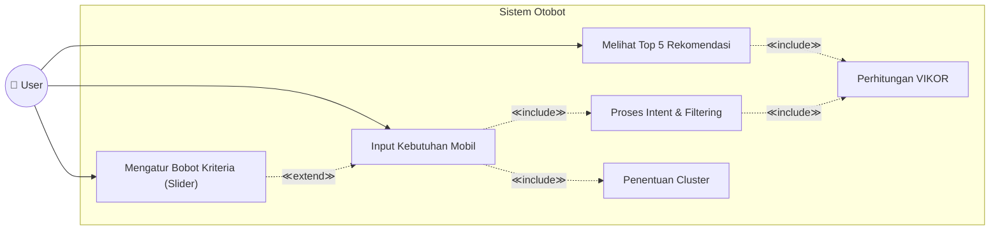
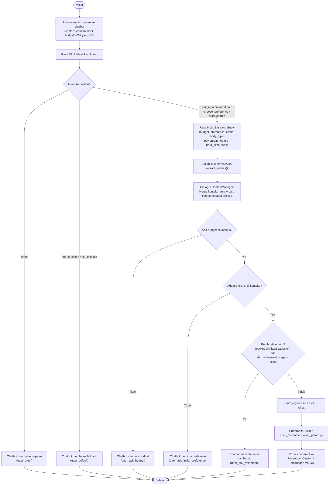
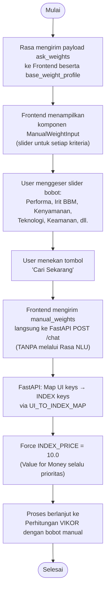
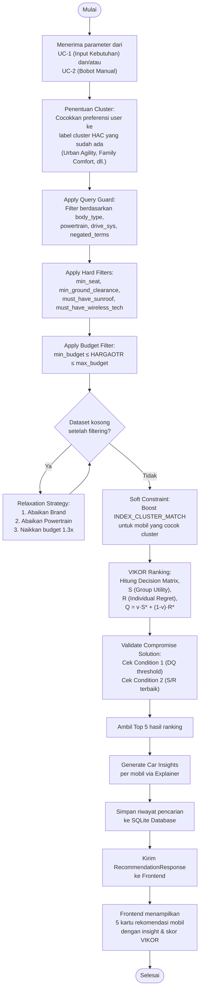

# Use Case & Activity Diagram — Chatbot Rekomendasi Mobil (Otobot)

---

## 1. Use Case Diagram

### Tabel Deskripsi Use Case

| UC | Nama | Aktor | Deskripsi | Relasi |
|----|------|-------|-----------|--------|
| UC-1 | Input Kebutuhan Mobil | User | User mengirim pesan berisi budget, preferensi, dan kebutuhan mobil melalui chatbot | `<<include>>` Proses Intent & Filtering, `<<include>>` Penentuan Cluster |
| UC-2 | Mengatur Bobot Kriteria (Slider) | User | User mengatur slider bobot prioritas (Performa, Irit, Nyaman, dll.) sebelum pencarian dijalankan | `<<extend>>` Input Kebutuhan Mobil (opsional) |
| UC-3 | Melihat Top 5 Rekomendasi | User | User melihat hasil 5 rekomendasi mobil terbaik beserta insight dan skor VIKOR | `<<include>>` Perhitungan VIKOR |

### Tabel Deskripsi Proses Sistem

| Proses | Deskripsi | Di-include oleh |
|--------|-----------|-----------------|
| Proses Intent & Filtering | Rasa NLU mengklasifikasikan intent dan mengekstraksi entity (budget, preference, brand, dll.), lalu QueryGuard memfilter dataset | UC-1, dan include ke Perhitungan VIKOR |
| Penentuan Cluster | Sistem mencocokkan preferensi user ke cluster HAC yang sudah terbentuk saat startup (Urban Agility, Family Comfort, dll.) | UC-1 |
| Perhitungan VIKOR | Algoritma VIKOR menghitung skor S, R, Q dan meranking mobil berdasarkan bobot kriteria | UC-3, di-include dari Proses Intent & Filtering |

### Penjelasan Relasi

- **`<<include>>`**: Proses yang **wajib** dijalankan. Contoh: UC-1 selalu memicu Proses Intent & Filtering.
- **`<<extend>>`**: Proses **opsional**. UC-2 (slider) memperluas UC-1 — user bisa langsung dapat rekomendasi tanpa mengatur slider (sistem menggunakan bobot default dari NLP).

---

## 2. Activity Diagram

### 2.1 Activity Diagram — UC-1: Input Kebutuhan Mobil

### 2.2 Activity Diagram — UC-2: Mengatur Bobot Kriteria (Slider)

### 2.3 Activity Diagram — UC-3: Melihat Top 5 Rekomendasi

---

## 3. Mapping Use Case ↔ Activity

| Use Case | Activity Diagram | Proses Sistem yang Terlibat |
|----------|-----------------|----------------------------|
| UC-1: Input Kebutuhan Mobil | AD 2.1 | Proses Intent & Filtering, Penentuan Cluster |
| UC-2: Mengatur Bobot Kriteria | AD 2.2 | — (langsung ke VIKOR, bypass NLU) |
| UC-3: Melihat Top 5 Rekomendasi | AD 2.3 | Penentuan Cluster, Perhitungan VIKOR |

> [!NOTE]
> Alur normal lengkap: **UC-1** → *(opsional)* **UC-2** → **UC-3**
> - User input kebutuhan (UC-1)
> - Sistem minta bobot slider, user atur (UC-2, extend/opsional)
> - Sistem proses VIKOR dan tampilkan hasil (UC-3)
